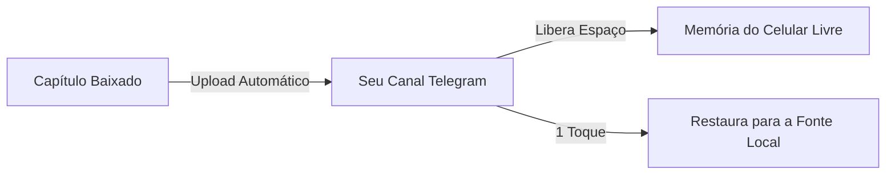

# Yomotsu

### Leitor de Mangás, Manhwas e Light Novels com Tradução por IA para Android

*Baseado no Mihon, com OCR avançado, tradução automática nos balões, leitor dedicado de novels e sincronização via Nuvem Telegram.*

 

 

[Recursos](#-principais-recursos) • [Motores de Tradução](#-motores-de-tradução) • [Nuvem Telegram](#-como-usar-a-nuvem-telegram) • [Download](#-download) • [Requisitos](#-requisitos) • [Créditos](#-créditos)

---

## 💡 Sobre o Yomotsu

O **Yomotsu** é um aplicativo Android completo de leitura que elimina a barreira do idioma. Ele reúne em um único lugar a leitura de **mangás, manhwas, webtoons, quadrinhos e Light Novels**, combinando tecnologias de **Visão Computacional (OCR)** e **Inteligência Artificial** para traduzir diálogos e textos diretamente na tela, sem necessidade de trocar de aplicativo ou usar tradutores externos.

O projeto foi construído sobre a consagrada base do **Mihon (Tachiyomi)**, trazendo toda a sua velocidade, organização e catálogo de fontes, acrescido de inovações exclusivas como tradução em tempo real focada em **Português Brasileiro**, um leitor de texto fluido para novels e o inovador sistema de **backup na Nuvem Telegram**.

---

## 🌟 Os 3 Pilares do Yomotsu

<table>
  <tr>
    <td width="33%" align="center">
      <h3>🏮 Tradução Inteligente</h3>
      
Reconhece o texto nos balões com OCR, limpa a arte original e insere a tradução em português perfeitamente diagramada.

    </td>
    <td width="33%" align="center">
      <h3>📖 Leitor de Light Novels</h3>
      
Modo de leitura de texto nativo com controle completo de fontes, tamanhos, margens e tradução de parágrafos.

    </td>
    <td width="33%" align="center">
      <h3>☁️ Nuvem Telegram</h3>
      
Armazenamento ilimitado no seu canal do Telegram para fazer backup de capítulos e economizar memória do celular.

    </td>
  </tr>
</table>

---

## 🚀 Principais recursos

### 🎮 Perfil Gamificado e Conquistas (NOVO!)
* **Sistema de XP e Níveis:** Ganhe XP automaticamente lendo ou baixando capítulos. Níveis infinitos com cálculo progressivo.
* **Títulos Equipáveis:** Desbloqueie títulos de progressão sombria e minimalista (como *Iniciante das Sombras* ou *Mestre das Sombras*) e equipe-os no seu perfil.
* **100 Conquistas Únicas:** Recompensas divididas em categorias (Bronze, Prata, Ouro e Rubi) para suas marcas de leitura, tamanho da biblioteca e histórico de downloads.
* **Identidade Personalizada:** Escolha seu Nickname, Avatar e um Banner expandido (arquivos salvos com segurança no cache interno).
* **Notificações em Tempo Real:** Alertas do sistema sempre que você conquistar um novo troféu.

### 📖 Leitura e Visualização
* **Suporte Completo a Obras:** Leia mangás, manhwas, webtoons, quadrinhos e **Light Novels / Webnovels**.
* **Leitor Dedicado de Novels:** Modo texto imersivo com tipografia ajustável (fontes, tamanho de letra, espaçamento entre linhas e margens personalizadas).
* **Modos de Imagem Avançados:** Modos de página simples, página dupla invertida e webtoon com rolagem vertical contínua.
* **Organização Total:** Biblioteca com categorias personalizadas, histórico de leitura sincronizado, rastreadores e downloads locais.
* **Interface Moderna:** Suporte completo a temas claro, escuro e dinâmico (Material You).

### 🌐 OCR e Tradução Automática com IA
* **Tradução sem sair do leitor:** Traduza páginas inteiras ou capítulos completos com apenas um toque.
* **OCR de Alta Precisão:** Reconhecimento óptico de caracteres nos idiomas inglês, japonês, coreano e chinês.
* **Múltiplos Provedores:** Escolha entre motores locais (sem gastar internet) e provedores de IA de última geração.
* **Inpainting & Diagramação:** Apagamento do texto original e adaptação automática do tamanho da fonte para caber no balão.
* **Glossário Contextual:** Memória por obra para manter nomes de personagens, golpes e termos traduzidos de forma consistente.
* **Ajuste Manual:** Toque em qualquer balão para editar a tradução ou solicitar retradução individual instantaneamente.

### ☁️ Nuvem Telegram (Backup & Economia de Armazenamento)
* **Backup no Telegram:** Envie capítulos de mangás e novels diretamente para o seu supergrupo ou canal privado.
* **Economia de Espaço no Celular:** Apague os arquivos locais automaticamente após o upload confirmado na nuvem.
* **Restauração em 1 Toque:** Baixe qualquer capítulo ou obra completa da nuvem diretamente para a Fonte Local a qualquer momento.
* **Gerenciador Integrado:** Visualize todas as obras salvas na nuvem, consulte capítulos e realize exclusões diretas.
* **Sincronização Inteligente:** Catálogo que detecta e remove apenas os capítulos que foram realmente apagados do Telegram, mantendo todas as suas obras seguras.

---

## 📊 Motores de Tradução

O Yomotsu oferece flexibilidade total para você escolher como traduzir suas leituras:

| Motor | Tipo | Chave de API | Idiomas Suportados | Vantagens |
| :--- | :---: | :---: | :---: | :--- |
| **ML Kit (Google)** | No dispositivo | ❌ Não precisa | EN, JA, KO, ZH | **100% Offline e Instantâneo** — Não consome franquia de internet. |
| **Google Tradutor** | Nuvem | ❌ Não precisa | Dezenas de idiomas | **Sem configuração** — Pronto para usar imediatamente. |
| **DeepL** | Nuvem (API) | 🔑 Necessária | EN, JA, ZH | **Fluidez Extrema** — Traduções gramaticais e naturais de alto nível. |
| **Google Gemini** | IA Generativa | 🔑 Gratuita | Todos os idiomas | **Compreensão Contextual** — Entende gírias, piadas e contexto narrativo. |
| **OpenRouter** | IA Multimodelo | 🔑 Necessária | Todos os idiomas | **Liberdade Total** — Conecte a modelos como Claude, GPT-4, Llama e outros. |

---

## ☁️ Como Usar a Nuvem Telegram

O Yomotsu utiliza a infraestrutura do Telegram para fornecer backup ilimitado e seguro para seus mangás e novels:

### Passo a Passo de Configuração:
1. **Crie um Canal ou Supergrupo Privado** no Telegram onde os arquivos serão armazenados.
2. Abra o Telegram e converse com o **[@BotFather](https://t.me/BotFather)**:
   * Envie `/newbot`, escolha um nome e usuário para o seu bot.
   * Copie o **Token de Acesso** gerado (ex: `123456789:ABCdef...`).
3. Adicione o seu bot como **Administrador** do seu canal com permissão de postar mensagens.
4. Pegue o **ID do Canal** (você pode encaminhar uma mensagem do canal para o bot `@userinfobot` ou `@RawDataBot` para obter o ID numérico, geralmente começando com `-100`).
5. No Yomotsu, abra **Mais > Configurações > Nuvem Telegram**:
   * Ative a opção **Nuvem Telegram**.
   * Cole o **Token do Bot** e o **ID do Chat/Canal**.
   * *(Opcional)* Ative **Excluir arquivos locais após upload** para poupar espaço interno!

> [!TIP]
> Com a sincronização inteligente da Nuvem Telegram, você pode manter sua biblioteca completa salva no canal e baixar apenas os capítulos que estiver lendo no momento.

---

## 📥 Download

A versão oficial mais recente pronta para instalação está sempre disponível em:

### [👉 Baixar a Última Versão do Yomotsu (APK)](https://github.com/kiritsuguxs/Yomotsu-Oficial/releases/latest)

* O arquivo principal é o **`Yomotsu-*-arm64.apk`** (otimizado para praticamente todos os celulares modernos).
* Instalações subsequentes funcionam como atualização direta por cima da versão existente, sem perda de biblioteca ou dados.

---

## ⚙️ Requisitos

* **Sistema Operacional:** Android 8.0 (Oreo) ou superior.
* **Permissões:** Acesso a notificações (para status de downloads e backups) e armazenamento.
* **Conexão:** Para os tradutores de IA na nuvem (DeepL, Gemini, OpenRouter) e para a Nuvem Telegram, é necessária conexão com a internet.

---

## 🤝 Créditos e Agradecimentos

O Yomotsu é fruto do esforço da comunidade open source:
* **[Mihon / Tachiyomi](https://github.com/mihonapp/mihon)** — A base e arquitetura que tornam este leitor tão estável e completo.
* **[TDLib (Telegram Database Library)](https://github.com/tdlib/td)** — Motor que viabiliza a integração nativa e robusta com o Telegram.
* **[Google ML Kit](https://developers.google.com/ml-kit)** — Reconhecimento e visão computacional em tempo real no dispositivo.
* A todos os desenvolvedores e tradutores que apoiam o ecossistema de leitura livre no Android.

---

  Yomotsu Oficial • Desenvolvido com foco na melhor experiência de leitura em Português Brasileiro.

