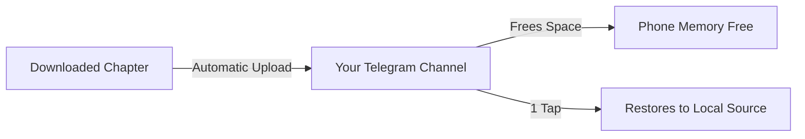

[🇧🇷 Português](README.md) | 🇺🇸 English | [🇪🇸 Español](README_ES.md)

# Yomotsu

### AI-Translated Manga, Manhwa, and Light Novel Reader for Android

*Based on Mihon, featuring advanced OCR, automatic bubble translation, a dedicated novel reader, and Telegram Cloud synchronization.*

 

 

[Features](#-main-features) • [Translation Engines](#-translation-engines) • [Telegram Cloud](#%E2%98%81%EF%B8%8F-how-to-use-telegram-cloud) • [Download](#-download) • [Requirements](#%E2%9A%99%EF%B8%8F-requirements) • [Credits](#-credits-and-acknowledgments)

---

## 💡 About Yomotsu

**Yomotsu** is a comprehensive Android reading app that breaks down the language barrier. It brings the reading of **mangas, manhwas, webtoons, comics, and Light Novels** into a single place, combining **Computer Vision (OCR)** and **Artificial Intelligence** technologies to translate dialogue and texts directly on the screen, without needing to switch apps or use external translators.

The project was built upon the renowned **Mihon (Tachiyomi)** base, keeping all its speed, organization, and source catalog, while adding exclusive innovations like real-time translation, a fluid text reader for novels, and an innovative **Telegram Cloud backup** system.

---

## 🌟 The 3 Pillars of Yomotsu

<table>
  <tr>
    <td width="33%" align="center">
      <h3>🏮 Smart Translation</h3>
      
Recognizes text inside bubbles using OCR, cleans the original artwork, and inserts the translated text perfectly typeset.

    </td>
    <td width="33%" align="center">
      <h3>📖 Light Novel Reader</h3>
      
Native immersive text reading mode with full control over fonts, sizes, margins, and paragraph translation.

    </td>
    <td width="33%" align="center">
      <h3>☁️ Telegram Cloud</h3>
      
Unlimited storage in your Telegram channel to backup chapters and save your phone's memory.

    </td>
  </tr>
</table>

---

## 🚀 Main features

### 🎮 Progression and Achievements System
* **XP and Leveling System:** Gain XP automatically by reading or downloading chapters. Infinite levels with progressive calculation.
* **Equippable Titles:** Unlock dark and minimalist progression titles (like *Shadow Beginner* or *Shadow Master*) and equip them on your profile.
* **100 Unique Achievements:** Rewards divided into categories (Bronze, Silver, Gold, and Ruby) for your reading milestones, library size, and download history.
* **Custom Identity:** Choose your Nickname, Avatar, and an expanded Banner.
* **Real-Time Notifications:** System alerts whenever you earn a new trophy.

### 📖 Reading and Viewing
* **Full Title Support:** Read mangas, manhwas, webtoons, comics, and **Light Novels / Webnovels**.
* **Dedicated Novel Reader:** Immersive text mode with adjustable typography (fonts, letter size, line spacing, and custom margins).
* **Advanced Image Modes:** Single page, inverted double page, and webtoon modes with continuous vertical scrolling.
* **Total Organization:** Library with custom categories, synchronized reading history, trackers, and local downloads.
* **Modern Interface:** Full support for light, dark, and dynamic themes (Material You).

### 🌐 OCR and AI Automatic Translation
* **Translate without leaving the reader:** Translate entire pages or full chapters with just one tap.
* **High Precision OCR:** Optical character recognition for English, Japanese, Korean, and Chinese.
* **Multiple Providers:** Choose between local engines (without consuming internet data) and next-gen AI providers.
* **Inpainting & Typesetting:** Erasure of original text and automatic font size adaptation to fit the bubble.
* **Contextual Glossary:** Per-series memory to keep character names, attacks, and terms translated consistently.
* **Manual Adjustment:** Tap any bubble to instantly edit the translation or request an individual re-translation.

### ☁️ Telegram Cloud (Backup & Storage Saving)
* **Telegram Backup:** Send manga and novel chapters directly to your supergroup or private channel.
* **Save Phone Space:** Automatically delete local files after a confirmed cloud upload.
* **1-Tap Restore:** Download any chapter or full series from the cloud directly back to the Local Source at any time.
* **Integrated Manager:** View all series saved in the cloud, check chapters, and perform direct deletions.
* **Smart Sync:** Catalog that detects and removes only chapters that were actually deleted from Telegram, keeping all your series safe.

---

## 📊 Translation Engines

Yomotsu offers total flexibility for you to choose how to translate your readings:

| Engine | Type | API Key | Supported Languages | Advantages |
| :--- | :---: | :---: | :---: | :--- |
| **ML Kit (Google)** | On-device | ❌ Not needed | EN, JA, KO, ZH | **100% Offline & Instant** — Consumes no data. |
| **Google Translate** | Cloud | ❌ Not needed | Dozens of languages | **No setup** — Ready to use immediately. |
| **DeepL** | Cloud (API) | 🔑 Required | EN, JA, ZH | **Extreme Fluency** — High-level grammatical and natural translations. |
| **Google Gemini** | Generative AI | 🔑 Free | All languages | **Contextual Understanding** — Understands slang, jokes, and narrative context. |
| **OpenRouter** | Multi-model AI | 🔑 Required | All languages | **Total Freedom** — Connect to models like Claude, GPT-4, Llama, and others. |

---

## ☁️ How to Use Telegram Cloud

Yomotsu uses Telegram's infrastructure to provide unlimited backup and 100% cloud reading (streaming) for your mangas and novels:

### Setup Step-by-Step:
1. **Create a Private Channel or Supergroup** on Telegram where files will be stored.
2. Open Telegram and chat with **[@BotFather](https://t.me/BotFather)**:
   * Send `/newbot`, choose a name and username for your bot.
   * Copy the generated **Access Token** (e.g., `123456789:ABCdef...`).
3. Add your bot as an **Administrator** of your channel with permission to post messages.
4. Get the **Channel ID** (you can forward a message from the channel to the `@userinfobot` or `@RawDataBot` bot to get the numeric ID, usually starting with `-100`).
5. In Yomotsu, open **More > Settings > Telegram Cloud**:
   * Enable the **Telegram Cloud** option.
   * Paste the **Bot Token** and the **Chat/Channel ID**.
   * *(Optional)* Enable **Delete local files after upload** to save internal space!

> [!TIP]
> **100% Cloud Reading (Streaming):** You don't need to download chapters back to your phone to read them! Yomotsu has a native Telegram Source that allows reading mangas and novels directly from the cloud, saving 100% of your internal storage.

---

## 📥 Download

The latest official version ready for installation is always available at:

### [👉 Download Latest Yomotsu Release (APK)](https://github.com/kiritsuguxs/Yomotsu-Oficial/releases/latest)

* The main file is **`Yomotsu-*-arm64.apk`** (optimized for almost all modern phones).
* Subsequent installations work as direct updates over the existing version, without losing your library or data.

---

## ⚙️ Requirements

* **OS:** Android 8.0 (Oreo) or higher.
* **Permissions:** Access to notifications (for download and backup statuses) and storage.
* **Connection:** Internet connection required for cloud AI translators (DeepL, Gemini, OpenRouter) and Telegram Cloud.

---

## ⚖️ Legal Disclaimer

Yomotsu is an open-source, non-profit software developed exclusively as a local file reader and personal cloud integration client. **Yomotsu does not host, distribute, or have any affiliation with services that provide copyrighted materials.** The application does not include extensions or catalogs of works. The user is solely responsible for all content they insert, translate, or backup using this tool.

---

## 🤝 Credits and Acknowledgments

Yomotsu is the result of the open-source community's effort:
* **[Mihon / Tachiyomi](https://github.com/mihonapp/mihon)** — The base and architecture that make this reader so stable and complete.
* **[TDLib (Telegram Database Library)](https://github.com/tdlib/td)** — Engine that enables native and robust integration with Telegram.
* **[Google ML Kit](https://developers.google.com/ml-kit)** — Real-time on-device optical character recognition and computer vision.
* To all developers and translators who support the free reading ecosystem on Android.

---

  Yomotsu Official • Developed focusing on the best reading experience.

