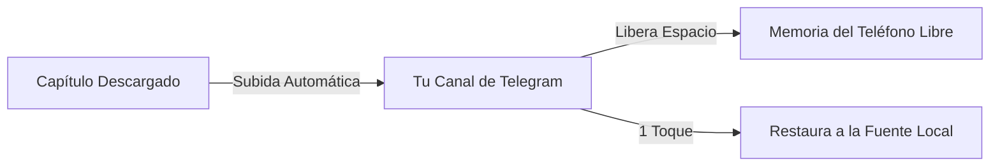

[🇧🇷 Português](README.md) | [🇺🇸 English](README_EN.md) | 🇪🇸 Español

# Yomotsu

### Lector de Mangas, Manhwas y Novelas Ligeras con Traducción por IA para Android

*Basado en Mihon, con OCR avanzado, traducción automática en las burbujas, lector dedicado de novelas y sincronización a través de la Nube de Telegram.*

 

 

[Características](#-características-principales) • [Motores de Traducción](#-motores-de-traducción) • [Nube de Telegram](#%E2%98%81%EF%B8%8F-c%C3%B3mo-usar-la-nube-de-telegram) • [Descarga](#-descarga) • [Requisitos](#%E2%9A%99%EF%B8%8F-requisitos) • [Créditos](#-créditos-y-agradecimientos)

---

## 💡 Sobre Yomotsu

**Yomotsu** es una aplicación de lectura para Android muy completa que elimina la barrera del idioma. Reúne en un solo lugar la lectura de **mangas, manhwas, webtoons, cómics y Novelas Ligeras**, combinando tecnologías de **Visión Computacional (OCR)** e **Inteligencia Artificial** para traducir diálogos y textos directamente en la pantalla, sin necesidad de cambiar de aplicación o usar traductores externos.

El proyecto fue construido sobre la reconocida base de **Mihon (Tachiyomi)**, manteniendo toda su velocidad, organización y catálogo de fuentes, pero sumando innovaciones exclusivas como traducción en tiempo real, un lector de texto fluido para novelas y el innovador sistema de **copia de seguridad en la Nube de Telegram**.

---

## 🌟 Los 3 Pilares de Yomotsu

<table>
  <tr>
    <td width="33%" align="center">
      <h3>🏮 Traducción Inteligente</h3>
      
Reconoce el texto en los globos con OCR, limpia el arte original e inserta la traducción perfectamente maquetada.

    </td>
    <td width="33%" align="center">
      <h3>📖 Lector de Novelas</h3>
      
Modo de lectura de texto nativo con control completo de fuentes, tamaños, márgenes y traducción de párrafos.

    </td>
    <td width="33%" align="center">
      <h3>☁️ Nube de Telegram</h3>
      
Almacenamiento ilimitado en tu canal de Telegram para guardar capítulos y ahorrar memoria del teléfono.

    </td>
  </tr>
</table>

---

## 🚀 Características principales

### 🎮 Sistema de Progresión y Logros
* **Sistema de XP y Niveles:** Gana XP automáticamente al leer o descargar capítulos. Niveles infinitos con cálculo progresivo.
* **Títulos Equipables:** Desbloquea títulos de progresión oscura y minimalista (como *Principiante de las Sombras* o *Maestro de las Sombras*) y equípalos en tu perfil.
* **100 Logros Únicos:** Recompensas divididas en categorías (Bronce, Plata, Oro y Rubí) por tus hitos de lectura, tamaño de la biblioteca e historial de descargas.
* **Identidad Personalizada:** Elige tu Apodo, Avatar y un Banner expandido.
* **Notificaciones en Tiempo Real:** Alertas del sistema cada vez que consigues un nuevo trofeo.

### 📖 Lectura y Visualización
* **Soporte Completo para Obras:** Lee mangas, manhwas, webtoons, cómics y **Novelas Ligeras / Webnovels**.
* **Lector Dedicado de Novelas:** Modo de texto inmersivo con tipografía ajustable (fuentes, tamaño de letra, interlineado y márgenes personalizados).
* **Modos de Imagen Avanzados:** Modos de página simple, página doble invertida y webtoon con desplazamiento vertical continuo.
* **Organización Total:** Biblioteca con categorías personalizadas, historial de lectura sincronizado, rastreadores y descargas locales.
* **Interfaz Moderna:** Soporte completo para temas claro, oscuro y dinámico (Material You).

### 🌐 OCR y Traducción Automática con IA
* **Traducción sin salir del lector:** Traduce páginas enteras o capítulos completos con un solo toque.
* **OCR de Alta Precisión:** Reconocimiento óptico de caracteres en idiomas inglés, japonés, coreano y chino.
* **Múltiples Proveedores:** Elige entre motores locales (sin gastar datos) y proveedores de IA de última generación.
* **Inpainting y Maquetación:** Borrado del texto original y adaptación automática del tamaño de la fuente para encajar en el globo.
* **Glosario Contextual:** Memoria por obra para mantener nombres de personajes, ataques y términos traducidos de forma consistente.
* **Ajuste Manual:** Toca cualquier globo para editar la traducción o solicitar una retraducción individual al instante.

### ☁️ Nube de Telegram (Backup y Ahorro de Almacenamiento)
* **Backup en Telegram:** Envía capítulos de mangas y novelas directamente a tu supergrupo o canal privado.
* **Ahorro de Espacio en el Teléfono:** Elimina los archivos locales automáticamente tras confirmar la subida a la nube.
* **Restauración en 1 Toque:** Descarga cualquier capítulo u obra completa desde la nube directamente a la Fuente Local en cualquier momento.
* **Gestor Integrado:** Visualiza todas las obras guardadas en la nube, consulta capítulos y realiza eliminaciones directas.
* **Sincronización Inteligente:** Catálogo que detecta y elimina solo los capítulos que realmente fueron borrados de Telegram, manteniendo tus obras seguras.

---

## 📊 Motores de Traducción

Yomotsu te ofrece total flexibilidad para elegir cómo traducir tus lecturas:

| Motor | Tipo | Clave API | Idiomas Soportados | Ventajas |
| :--- | :---: | :---: | :---: | :--- |
| **ML Kit (Google)** | En el dispositivo | ❌ No requiere | EN, JA, KO, ZH | **100% Offline e Instantáneo** — No consume datos de internet. |
| **Traductor de Google**| Nube | ❌ No requiere | Decenas de idiomas | **Sin configuración** — Listo para usar de inmediato. |
| **DeepL** | Nube (API) | 🔑 Requerida | EN, JA, ZH | **Fluidez Extrema** — Traducciones gramaticales y naturales de alto nivel. |
| **Google Gemini** | IA Generativa | 🔑 Gratuita | Todos los idiomas | **Comprensión Contextual** — Entiende jergas, bromas y contexto narrativo. |
| **OpenRouter** | IA Multimodelo | 🔑 Requerida | Todos los idiomas | **Libertad Total** — Conecta con modelos como Claude, GPT-4, Llama y otros. |

---

## ☁️ Cómo Usar la Nube de Telegram

Yomotsu utiliza la infraestructura de Telegram para ofrecerte copias de seguridad ilimitadas y lectura 100% en la nube (streaming) para tus mangas y novelas:

### Paso a Paso para la Configuración:
1. **Crea un Canal o Supergrupo Privado** en Telegram donde se almacenarán los archivos.
2. Abre Telegram y habla con el **[@BotFather](https://t.me/BotFather)**:
   * Envía `/newbot`, elige un nombre y usuario para tu bot.
   * Copia el **Token de Acceso** generado (ej: `123456789:ABCdef...`).
3. Añade tu bot como **Administrador** de tu canal con permiso para publicar mensajes.
4. Obtén el **ID del Canal** (puedes reenviar un mensaje del canal al bot `@userinfobot` o `@RawDataBot` para obtener el ID numérico, que normalmente empieza por `-100`).
5. En Yomotsu, abre **Más > Ajustes > Nube de Telegram**:
   * Activa la opción **Nube de Telegram**.
   * Pega el **Token del Bot** y el **ID del Chat/Canal**.
   * *(Opcional)* ¡Activa **Eliminar archivos locales tras subir** para ahorrar espacio interno!

> [!TIP]
> **Lectura 100% en la Nube (Streaming):** ¡No necesitas descargar los capítulos de vuelta al teléfono para leerlos! Yomotsu tiene una Fuente nativa de Telegram que permite leer mangas y novelas directamente desde la nube, ahorrando el 100% de tu almacenamiento interno.

---

## 📥 Descarga

La versión oficial más reciente lista para instalar está siempre disponible en:

### [👉 Descargar la Última Versión de Yomotsu (APK)](https://github.com/kiritsuguxs/yomotsu/releases/latest)

* El archivo principal es **`Yomotsu-*-arm64.apk`** (optimizado para prácticamente todos los teléfonos modernos).
* Las instalaciones posteriores funcionan como actualización directa sobre la versión existente, sin pérdida de biblioteca o datos.

---

## ⚙️ Requisitos

* **Sistema Operativo:** Android 8.0 (Oreo) o superior.
* **Permisos:** Acceso a notificaciones (para el estado de descargas y backups) y almacenamiento.
* **Conexión:** Se necesita conexión a internet para los traductores de IA en la nube (DeepL, Gemini, OpenRouter) y para la Nube de Telegram.

---

## ⚖️ Aviso Legal

Yomotsu es un software de código abierto y sin fines de lucro, desarrollado exclusivamente como lector de archivos locales y cliente de integración personal en la nube. **Yomotsu no aloja, no distribuye y no tiene afiliación con servicios que proporcionan material protegido por derechos de autor.** La aplicación no incluye extensiones o catálogos de obras. El usuario es el único responsable de todo el contenido que inserte, traduzca o respalde usando esta herramienta.

---

## 🤝 Créditos y Agradecimientos

Yomotsu es fruto del esfuerzo de la comunidad open source:
* **[Mihon / Tachiyomi](https://github.com/mihonapp/mihon)** — La base y arquitectura que hacen a este lector tan estable y completo.
* **[TDLib (Telegram Database Library)](https://github.com/tdlib/td)** — Motor que viabiliza la integración nativa y robusta con Telegram.
* **[Google ML Kit](https://developers.google.com/ml-kit)** — Reconocimiento óptico de caracteres y visión por computadora en tiempo real en el dispositivo.
* A todos los desarrolladores y traductores que apoyan el ecosistema de lectura libre en Android.

---

  Yomotsu Oficial • Desarrollado con enfoque en la mejor experiencia de lectura.

